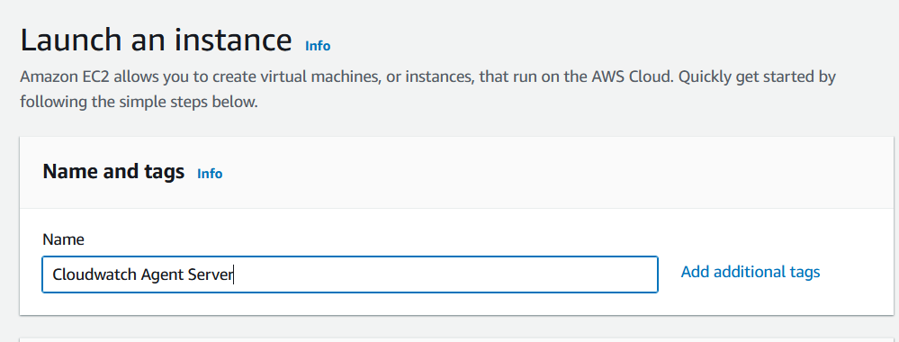
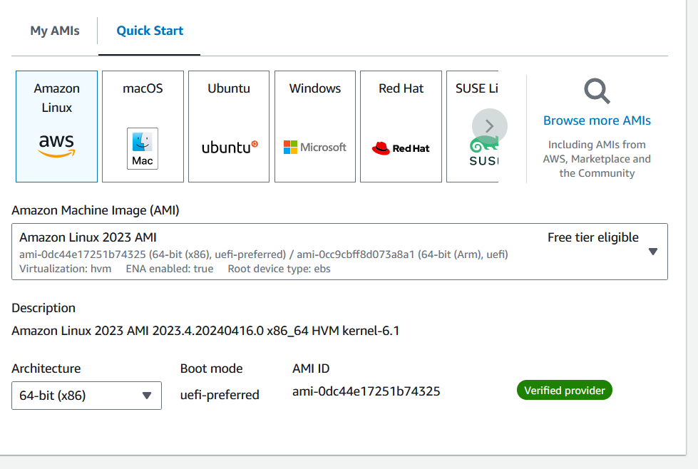
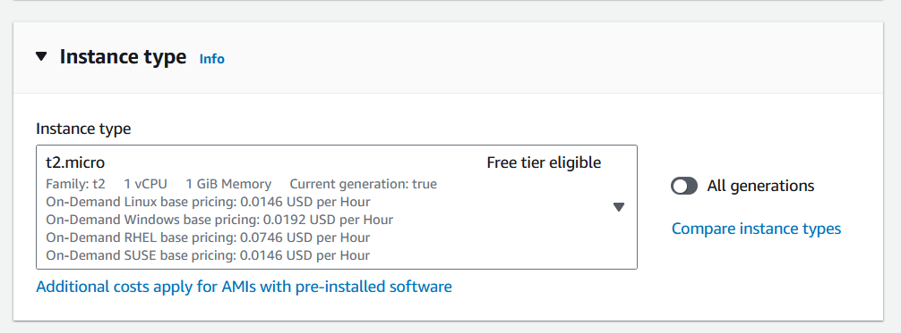
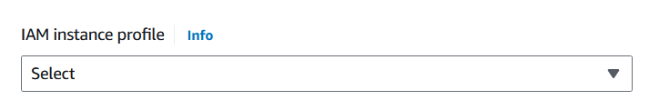
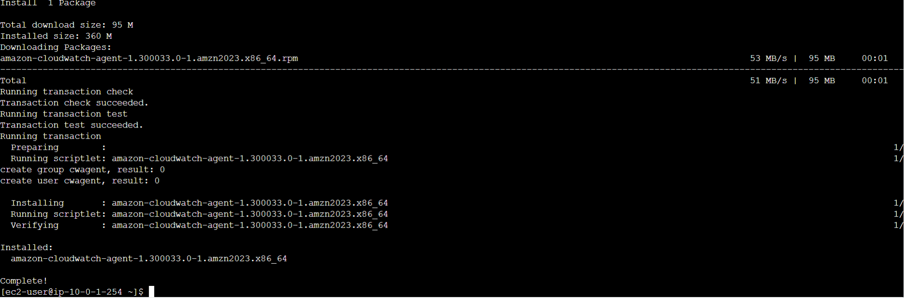

# cloudwatch-agent







Choose `CloudWatchAgentAdminPolicy` role which  already created by using AWS Managed Rule `CloudWatchAgentAdminPolicy`




sudo yum install amazon-cloudwatch-agent
 
sudo /opt/aws/amazon-cloudwatch-agent/bin/amazon-cloudwatch-agent-config-wizard
 
sudo /opt/aws/amazon-cloudwatch-agent/bin/amazon-cloudwatch-agent-ctl -a fetch-config -m ec2 -s -c file:/opt/aws/amazon-cloudwatch-agent/bin/config.json
 
sudo systemctl status amazon-cloudwatch-agent
 
sudo systemctl start amazon-cloudwatch-agent
 
sudo systemctl enable amazon-cloudwatch-agent


- For installation CloudWatch agent we need to execute the following command:

```sudo yum install amazon-cloudwatch-agent -y```



- After running this command you will see that installation is complete.

Amazon Cloud watch

- Configure the CloudWatch agent with the wizard and fill in data about our log file.To create a configuration file execute the following command:

sudo /opt/aws/amazon-cloudwatch-agent/bin/amazon-cloudwatch-agent-config-wizard

After running this command we need to answer the following questions (I will provide answers for my configuration):

    On which OS are you planning to use the agent? (Linux)
    Are you using EC2 or On-Premises hosts? (EC2)
    Which user are you planning to run the agent? (root)
    Do you want to turn on the StatsD daemon? (yes)
    StatsD is a popular open-source solution that can gather metrics from a wide variety of applications.
    Which port do you want the StatsD daemon to listen to? (8125)
    What is the collection interval for the StatsD daemon? (10s)
    What is the aggregation interval for metrics collected by StatsD daemon?(the 60s)
    Do you want to monitor metrics from CollectD?(No)
    Do you want to monitor any host metrics? e.g. CPU, memory, etc. (yes)
    Do you want to monitor CPU metrics per core? (yes)
    Do you want to add ec2 dimensions (ImageId, InstanceId, InstanceType, AutoScalingGroupName) into all of your metrics if the info is available? (yes)
    Do you want to aggregate ec2 dimensions (InstanceId)? (yes)
    Would you like to collect your metrics at high resolution (sub-minute resolution)? This enables sub-minute resolution for all metrics, but you can customize for specific metrics in the output JSON file. (60s)
    Which default metrics config do you want? (Standard) 
    On this question, you can choose the answer between Basic, Standard, Advanced, and None. (Detailed description below)

Detail level 	Metrics included
Basic 	

Mem: mem_used_percent

Disk: disk_used_percent

The disk metrics such as disk_used_percent have a dimension for Partition, which means that the number of custom metrics generated is dependent on the number of partitions associated with your instance. The number of disk partitions you have depends on which AMI you are using and the number of Amazon EBS volumes you attach to the server.
Standard 	

CPU: cpu_usage_idle, cpu_usage_iowait, cpu_usage_user, cpu_usage_system

Disk: disk_used_percent, disk_inodes_free

Diskio: diskio_io_time

Mem: mem_used_percent

Swap: swap_used_percent
Advanced 	

CPU: cpu_usage_idle, cpu_usage_iowait, cpu_usage_user, cpu_usage_system

Disk: disk_used_percent, disk_inodes_free

Diskio: diskio_io_time, diskio_write_bytes, diskio_read_bytes, diskio_writes, diskio_reads

Mem: mem_used_percent

Netstat: netstat_tcp_established, netstat_tcp_time_wait

Swap: swap_used_percent

After that, you will see the current configuration (JSON format) and you will need to answer the questions:

    Are you satisfied with the above config? (yes)
    Do you have any existing CloudWatch Log Agent? (no)
    Do you want to monitor any log files? (yes)
    Because in this tutorial we will monitor our Apache log file(e.g. error_log)
    Log file path: (/var/log/httpd/error_log)
    default choice: (e.g. CloudWatchDemo)
    Log stream name: ({instance_id})
    Log Group Retention in days (2)
    Do you want to specify any additional log files to monitor? (no)
    Do you want to store the config in the SSM parameter store? (no)

After answering these questions, we see that program exits:

Program exists know

The configuration file will store in the “bin” folder:

ls /opt/aws/amazon-cloudwatch-agent/bin/

Config.jason

Step 3: Start the CloudWatch agent with our configuration file.To launch the CloudWatch agent we need to execute the following command:

sudo /opt/aws/amazon-cloudwatch-agent/bin/
amazon-cloudwatch-agent-ctl -a fetch-config -m ec2 -c 
file:/opt/aws/amazon-cloudwatch-agent/bin/config.json -s

In this command, -a fetch-config causes the agent to load the latest version of the CloudWatch agent configuration file, and 

-s starts the agent.

After running this command we see that execution is successfully finished.

Configuration Validation
Steps To Verify The Cloud Watch For Apache Log File

For that, we need to execute the following steps:

Step 1: Go to the navigation panel, and choose CloudWatch.Go to the Log groups. In this folder, we can see the log file from the EC2 Linux instance.

Log Groups

Addition: In the metric group, we can see all metrics about our EC2 instance(e.g. CPU usage, disk_used_percent, mem_used_percent, swap_used_percent, etc.).

All metrics

Here's a complete roadmap for you to become a developer: Learn DSA -> Master Frontend/Backend/Full Stack -> Build Projects -> Keep Applying to Jobs

And why go anywhere else when our DSA to Development: Coding Guide helps you do this in a single program! Apply now to our DSA to Development Program and our counsellors will connect with you for further guidance & support.
